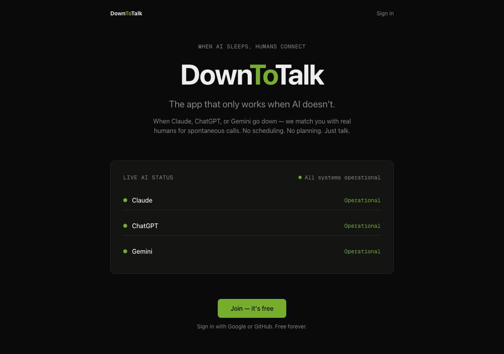
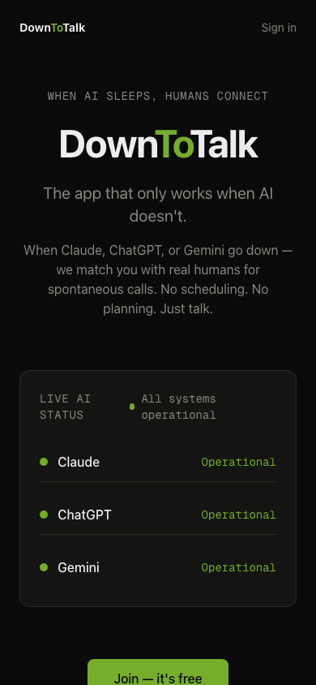
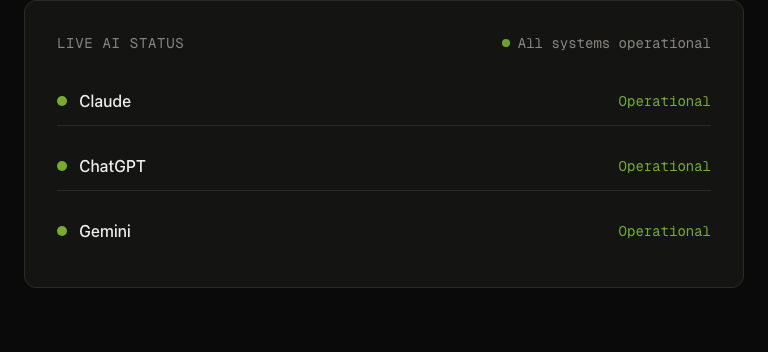

<div align="center">

# DownToTalk

**When AI sleeps, humans connect.**

The app that only works when AI doesn't.

[Live Demo](https://downtotalk.vercel.app) · [Telegram Bot](https://t.me/Downtotalk_bot)


</div>

---

<p align="center">
  
</p>

## The idea

You hit your Claude rate limit. ChatGPT says "try again later." You stare at an error message.

**What if that moment became a reason to talk to another human?**

DownToTalk monitors AI service status in real-time. When you hit your limit, one tap makes you available to your circle. They get a Telegram notification with buttons to reach you directly — no scheduling, no app switching.

## How it works

1. **You hit your limit** — Tap "Claude" / "ChatGPT" / "Gemini"
2. **Your circle gets notified** — Telegram message with inline contact buttons
3. **Talk** — One tap to message on Telegram, call on WhatsApp, or join Zoom

<p align="center">
  
</p>

## Live AI Status

DownToTalk shows real-time status of Claude, ChatGPT, and Gemini — pulled from official status pages every 5 minutes.

<p align="center">
  
</p>

## Architecture

```mermaid
graph LR
    A[User hits limit] -->|One tap| B[DownToTalk API]
    B -->|Save event| C[(Neon DB)]
    B -->|Fire & forget| D[Telegram Bot]
    D -->|Inline keyboard| E[Circle members]
    E -->|Tap button| F[Direct call/chat]

    G[UptimeRobot] -->|Every 5 min| H[/api/status]
    H -->|RSS/JSON| I[Claude/OpenAI/Gemini]
    H -->|Status changed?| D
```

## Tech Stack

| Layer | Technology |
|-------|-----------|
| Framework | Next.js 16 (App Router) |
| Frontend | React 19, Tailwind CSS 4 |
| Database | Neon (serverless PostgreSQL) |
| ORM | Drizzle |
| Auth | NextAuth 5 (GitHub OAuth) |
| Notifications | Telegram Bot API |
| Monitoring | RSS/JSON parsing + UptimeRobot |
| Hosting | Vercel |

## Public API

DownToTalk exposes a free, unauthenticated API endpoint:

```
GET https://downtotalk.vercel.app/api/status
```

Returns real-time AI service status and availability data:

```json
{
  "statuses": [
    {"service": "claude", "status": "operational", "...": ""},
    {"service": "openai", "status": "operational", "...": ""},
    {"service": "gemini", "status": "operational", "...": ""}
  ],
  "availableCount": 3,
  "timestamp": "2026-03-18T20:00:00.000Z"
}
```

Use it in your tools, dashboards, or bots. No API key needed.

## Quick Start

```bash
git clone https://github.com/vasilievyakov/downtotalk.git
cd downtotalk
npm install
cp .env.example .env.local
npm run dev
```

## Why?

> We spend 8 hours a day talking to machines. When the machines stop talking back, we stare at error messages.
>
> Claude uptime is 99.64%. But rate limits hit thousands daily. Every limit is an opportunity to remember what screens were originally for — connecting people.

## License

MIT

---

<div align="center">

**[Try it](https://downtotalk.vercel.app)**

*Built in a weekend. Because sometimes the best thing AI can do is shut up.*

</div>
