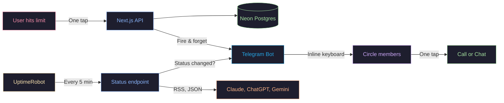

<h1 align="center">Down<span>To</span>Talk</h1>

<p align="center">
  <em>The app that only works when AI doesn't.<br>When AI goes down, your friends go online.</em>
</p>

<p align="center">
  <a href="https://downtotalk.vercel.app"><strong>Try it live →</strong></a>
</p>

<p align="center">
  <a href="https://github.com/vasilievyakov/downtotalk/blob/main/LICENSE">
    
  </a>
  
  
</p>

<br>

```bash
# Check AI status right now
curl -s https://downtotalk.vercel.app/api/status | jq '.statuses[] | {service, status}'
```

```json
{"service": "claude", "status": "operational"}
{"service": "openai", "status": "operational"}
{"service": "gemini", "status": "operational"}
```

<br>

<p align="center">
  
</p>

<p align="center">
  
</p>

<p align="center"><em>Dashboard shows live status. When you tap "Claude" — your circle gets a Telegram message with buttons to reach you. One tap → you're talking.</em></p>

<br>

## Why this exists

Claude went down during a deadline. I refreshed the status page for twenty minutes before realizing my friend was probably doing the same thing, three time zones away. That's the moment this project started — not the code, but the realization that AI outages are collective events experienced in isolation.

We built tools that replaced human contact for 8 hours a day. When those tools fail, we don't remember how to reach each other. DownToTalk is a pressure valve for a problem we created.

> 99.64% uptime sounds great until you realize that's **31 hours of downtime per year.** Claude has had **144 incidents since October 2025**. Average duration: **256 minutes** — over 4 hours of people staring at error messages, alone.
>
> <sup>Sources: status.claude.com, IsDown.app</sup>

<br>

## How it works (in 60 seconds)

**Two triggers, one outcome:**

🔴 **You hit your rate limit** → tap Claude / ChatGPT / Gemini on the dashboard. Your circle gets a Telegram message with buttons to call you directly.

🟡 **A service goes down** → we detect it automatically (RSS/JSON polling every 5 min). Your circle gets notified. No button needed.

```
RSS feed (Claude, ChatGPT, Gemini)
  → parse status
  → diff with last known state in DB
  → status changed?
    → yes: Telegram Bot API → inline keyboard → deep link to call/chat
    → no: save status, move on
```

> [!NOTE]
> **Why RSS and not webhooks?** AI providers don't offer outage webhooks. RSS feeds from their status pages are the most reliable public signal. We parse them, compare with last known state, and notify only on transitions. Yes, this means up to 5 minutes of detection lag. We chose simplicity over speed.

<br>

## What we tried and didn't work

- **Email notifications.** Nobody opens email fast enough for a spontaneous call. By the time you read it, the moment is gone.
- **Public feed instead of circles.** You don't want strangers calling you when Claude goes down. Invite-only circles won.
- **Webhooks from providers.** None of them offer outage webhooks. We tried. RSS it is.
- **Browser push notifications.** No support for rich actions (buttons to call). Telegram inline keyboards solved this.
- **Vercel Cron for polling.** Hobby plan limits cron to 1/day. UptimeRobot (free) pings every 5 minutes. Simple beats clever.

<br>

## Limitations

- Circles are small by design (< 20 people). This is not a broadcast tool.
- 5-minute polling means we catch outages ~2.5 min late on average.
- Telegram-only for now. No SMS, no email, no Slack.
- No historical outage data yet. We detect, notify, move on.
- In-memory rate limiter doesn't scale across serverless instances. Fine for now, needs Redis later.

<br>

## Public API

```
GET https://downtotalk.vercel.app/api/status
```

Returns real-time AI service status + how many people are free. **No API key.** Build on it.

<details>
<summary><strong>Full response example</strong></summary>

```json
{
  "statuses": [
    {"service": "claude", "status": "operational", "statusText": "Operational", "lastChecked": "2026-03-18T20:00:00.000Z"},
    {"service": "openai", "status": "operational", "statusText": "Operational", "lastChecked": "2026-03-18T20:00:00.000Z"},
    {"service": "gemini", "status": "operational", "statusText": "Operational", "lastChecked": "2026-03-18T20:00:00.000Z"}
  ],
  "availableCount": 2,
  "timestamp": "2026-03-18T20:00:00.000Z"
}
```

</details>

<br>

## Fork ideas

- Slack bot instead of Telegram
- Monitor your own API endpoints, not just AI providers
- Add Discord, email, SMS channels
- Build a public "AI Status" dashboard with historical data
- Random matching for communities (replace dead "random coffee" bots)

<br>

<details>
<summary><strong>Architecture</strong></summary>



| Layer | Technology | Why |
|-------|-----------|-----|
| Framework | Next.js 16 (App Router) | SSR for landing, API routes for backend |
| Frontend | React 19, Tailwind CSS 4 | Fast iteration |
| Database | Neon (serverless PostgreSQL) | Scales to zero, generous free tier |
| ORM | Drizzle | Type-safe, lightweight |
| Auth | NextAuth 5 (GitHub + Google OAuth) | Developer audience + broad access |
| Notifications | Telegram Bot API | Inline keyboards, no app install needed |
| Monitoring | UptimeRobot (free) | Reliable external cron, 5 min interval |
| Hosting | Vercel (Hobby) | Free, auto-deploy from GitHub |

</details>

<details>
<summary><strong>Key technical decisions</strong></summary>

**Why Telegram, not email or push notifications?**
Telegram has inline keyboard buttons. One tap from the notification → you're in a conversation. Email can't do that. Browser push doesn't support rich actions. Telegram gives us an app-like experience without building an app.

**Why UptimeRobot, not Vercel Cron?**
Vercel Hobby plan limits cron jobs to once per day. We need checks every 5 minutes. UptimeRobot is free, reliable, and pings our endpoint on schedule.

**Why circles, not a public feed?**
You don't want strangers calling you when Claude goes down. You want your friends. Circles are invite-only — you control who sees your availability.

**Why 2-hour TTL on availability?**
Without it, people who toggle "available" and forget about it stay visible forever. Ghost users destroy trust. After 2 hours, auto-reset.

</details>

<br>

## Get started

**As a user:** Visit **[downtotalk.vercel.app](https://downtotalk.vercel.app)** → sign in → connect Telegram → invite one friend. 90 seconds.

**As a developer:**

```bash
git clone https://github.com/vasilievyakov/downtotalk.git
cd downtotalk && npm install && cp .env.example .env.local
# Add your credentials to .env.local
npx drizzle-kit push && npm run dev
```

<details>
<summary><strong>Environment variables</strong></summary>

| Variable | Description |
|----------|-------------|
| `DATABASE_URL` | Neon pooled connection string |
| `DATABASE_URL_UNPOOLED` | Neon direct connection (for migrations) |
| `AUTH_SECRET` | NextAuth secret |
| `AUTH_GITHUB_ID` | GitHub OAuth app ID |
| `AUTH_GITHUB_SECRET` | GitHub OAuth app secret |
| `AUTH_GOOGLE_ID` | Google OAuth client ID |
| `AUTH_GOOGLE_SECRET` | Google OAuth client secret |
| `TELEGRAM_BOT_TOKEN` | Telegram bot token |
| `TELEGRAM_WEBHOOK_SECRET` | Webhook verification secret |

</details>

<br>

## Contributing

Issues welcome. PRs reviewed within 48 hours. If you're adding a new notification channel (Slack, Discord, SMS), open an issue first — happy to discuss architecture.

---

<p align="center">
  <em>We spend 8 hours a day talking to machines.<br>
  When the machines stop talking back, we stare at error messages.</em>
</p>

<p align="center">
  <strong><a href="https://downtotalk.vercel.app">downtotalk.vercel.app</a></strong>
</p>

<p align="center">
  <em>Built in a weekend with <a href="https://claude.ai/code">Claude Code</a>.<br>
  The best feature of AI is when it reminds you that humans exist.</em>
</p>
