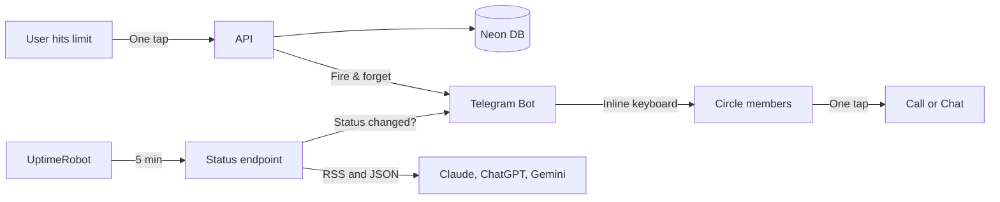

<div align="center">

<br>

# Down**To**Talk

### When AI sleeps, humans connect.

The app that only works when AI doesn't.

<br>

[**Try it live →**](https://downtotalk.vercel.app)

<br>


<br>


</div>

<br>

## You know the moment.

Claude says *"rate limit exceeded."* ChatGPT says *"try again later."* You stare at an error message and refresh the page.

**DownToTalk turns that dead moment into a human one.**

One tap → your circle knows you're free → they reach you directly on Telegram, WhatsApp, or Zoom. No scheduling. No planning. Just talk.

When a service goes down for everyone — we detect it automatically and notify your circle.

<br>

## One tap. Three buttons. Real conversation.

<p align="center">
  
</p>

Your friend hits their Claude limit. You get this in Telegram. One tap — you're talking. That's the whole product.

<br>

## How it works

```
You hit "Claude"                    Your circle sees this in Telegram:
on the dashboard     ──────►        "Nastya is free — hit the Claude limit"
                                     [Message on Telegram]
                                     [Call on WhatsApp]
                                     [Open dashboard]
```

We also monitor AI status pages every 5 minutes. When Claude, ChatGPT, or Gemini goes down — your circle gets notified automatically. No button needed.

<br>

## Architecture



<br>

## Public API

```
GET https://downtotalk.vercel.app/api/status
```

Returns real-time AI service status + how many people are free. No API key. Build on it.

<details>
<summary>Example response</summary>

```json
{
  "statuses": [
    {"service": "claude", "status": "operational", "statusText": "Operational"},
    {"service": "openai", "status": "operational", "statusText": "Operational"},
    {"service": "gemini", "status": "operational", "statusText": "Operational"}
  ],
  "availableCount": 2,
  "timestamp": "2026-03-18T20:00:00.000Z"
}
```

</details>

<br>

## Stack

Next.js 16 · React 19 · Tailwind 4 · Drizzle · Neon Postgres · NextAuth 5 · Telegram Bot API · UptimeRobot · Vercel

<br>

## Quick Start

```bash
git clone https://github.com/vasilievyakov/downtotalk.git && cd downtotalk
npm install && cp .env.example .env.local && npm run dev
```

<br>

---

<div align="center">

<br>

> *We spend 8 hours a day talking to machines.*
> *When the machines stop talking back, we stare at error messages.*
>
> *Claude uptime is 99.64%. But rate limits hit thousands daily.*
> *Every limit is an opportunity to remember what screens were originally for — connecting people.*

<br>

**[downtotalk.vercel.app](https://downtotalk.vercel.app)**

*Built in a weekend. Because sometimes the best thing AI can do is shut up.*

<br>

</div>
