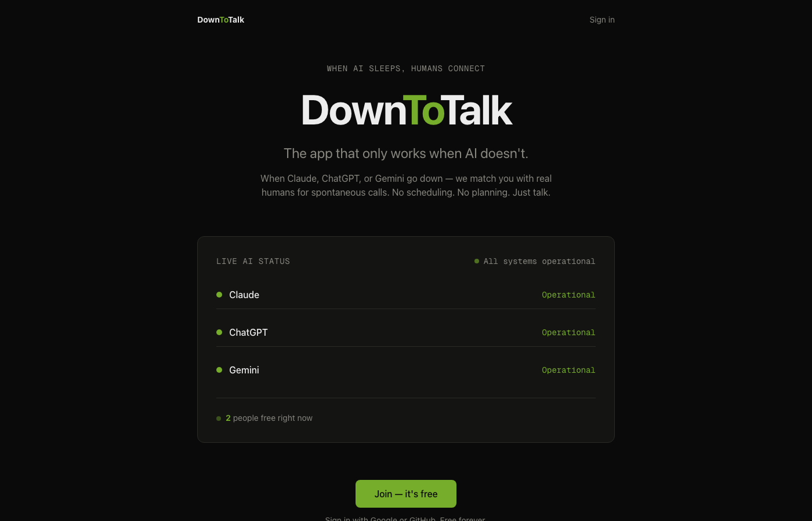
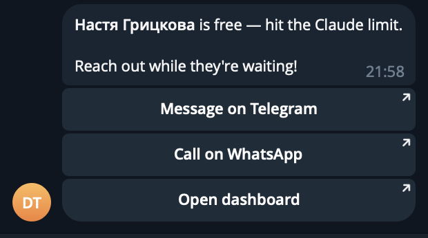

<div align="center">

<br>

# Down**To**Talk

### The app that only works when AI doesn't.

When Claude, ChatGPT, or Gemini goes down — or you hit your rate limit — DownToTalk connects you with real humans for spontaneous conversations. No scheduling. No planning. Just talk.

<br>

[**Try it live →**](https://downtotalk.vercel.app)

<br>


<br>



</div>

<br>

---

<br>

## The moment

You're deep in a conversation with Claude. Debugging a gnarly issue. Building something important. Then:

```
Rate limit exceeded. Please try again later.
```

You stare at the screen. You refresh. You check the status page. You open Twitter to see if others are affected. You wait.

Meanwhile, your friend — three time zones away — just hit the same wall. She's doing the same thing: staring, refreshing, waiting.

**You could have been talking to each other.**

That's DownToTalk. It turns the worst moment of your AI workflow into the best moment of your day.

<br>

## How it actually works

```
┌──────────────┐       ┌──────────────┐       ┌──────────────────────────┐
│ Claude says  │       │  One tap:    │       │  Your circle gets a      │
│ "rate limit  │ ────→ │  "I hit my   │ ────→ │  Telegram notification:  │
│  exceeded"   │       │   limit"     │       │                          │
└──────────────┘       └──────────────┘       │  [Message on Telegram]   │
                                              │  [Call on WhatsApp]      │
                                              │  [Join Zoom]             │
                                              └──────────────────────────┘
```

**Two triggers, one outcome:**

| Trigger | How it fires | What happens |
|---------|-------------|--------------|
| **You hit your limit** | One tap on the dashboard | Your circle gets a Telegram notification with buttons to reach you |
| **Service goes down** | Automatic — we check every 5 min | All subscribers of that service get notified |

Either way: your friends know you're free, and they can reach you in one tap.

<br>

## What your friends see

<p align="center">
  
</p>

<p align="center"><em>Not a link to a dashboard. Not an email. A message with buttons.<br>One tap → you're talking. That's the whole product.</em></p>

<br>

## The before and after

```
Without DownToTalk:                    With DownToTalk:

Claude is down.                        Claude is down.
You stare at the screen.               Your friends get notified.
You refresh every 30 seconds.          Someone messages you on Telegram.
You check Twitter.                     You have coffee over Zoom.
You feel stuck and alone.              You feel connected.
The outage ends.                       The outage ends.
You go back to work.                   You go back to work, but lighter.
```

<br>

## What we monitor — and how

We track the **official status pages** of three major AI providers:

| Service | Source | Method |
|---------|--------|--------|
| Claude | `status.claude.com/history.rss` | RSS feed parsing |
| ChatGPT | `status.openai.com/history.rss` | RSS feed parsing |
| Gemini | `status.cloud.google.com/incidents.json` | JSON endpoint |

[UptimeRobot](https://uptimerobot.com) pings our `/api/status` endpoint every 5 minutes. On each ping:

1. Fetch current status from all three providers
2. Compare with previous status stored in our database
3. If status degraded → notify all subscribers of that service via Telegram
4. If status recovered → no notification (you'll see it on the dashboard)

> **Why RSS and not webhooks?** Because AI providers don't offer outage webhooks. RSS feeds from their status pages are the most reliable public signal available. We parse them, compare with the last known state, and fire notifications only on transitions.

<br>

## The data

| Metric | Value | Source |
|--------|-------|--------|
| Claude uptime (90 days) | 99.64% | status.claude.com |
| Claude.ai uptime (90 days) | 99.38% | status.claude.com |
| Average incident duration | ~256 min | IsDown.app |
| Incidents since Oct 2025 | 144 | IsDown.app |
| Rate limit complaints (daily, Reddit) | Hundreds | r/ClaudeAI, r/ChatGPT |
| Direct competitors | **Zero** | Market research |

> 99.64% uptime sounds great until you realize that's 1,900 minutes of downtime per year. That's 31 hours. 31 hours of people staring at error messages — when they could be talking to each other.

<br>

## Public API

We expose a free, unauthenticated endpoint:

```
GET https://downtotalk.vercel.app/api/status
```

Returns real-time AI service status and how many people are free right now. No API key. Build on it — dashboards, Slack bots, CLI tools, whatever you want.

<details>
<summary>Example response</summary>

```json
{
  "statuses": [
    {"service": "claude", "status": "operational", "statusText": "Operational", "lastChecked": "2026-03-18T20:00:00.000Z"},
    {"service": "openai", "status": "operational", "statusText": "Operational", "lastChecked": "2026-03-18T20:00:00.000Z"},
    {"service": "gemini", "status": "operational", "statusText": "Operational", "lastChecked": "2026-03-18T20:00:00.000Z"}
  ],
  "availableCount": 2,
  "timestamp": "2026-03-18T20:00:00.000Z"
}
```

</details>

<br>

## What this is — and isn't

| DownToTalk is | DownToTalk is not |
|---------------|-------------------|
| A way to find your friends when AI is down | A social network |
| Telegram notifications with direct contact buttons | A chat app or video platform |
| Automatic outage detection for Claude, ChatGPT, Gemini | A replacement for status pages |
| Free, open source, MIT licensed | A SaaS product with plans and pricing |
| Built in a weekend | Built by a team of 50 |

<br>

## Architecture

```
User hits limit ──→ Next.js API ──→ Neon Postgres
                         │
                         ├──→ Telegram Bot (inline keyboard)
                         │         │
                         │         └──→ Circle members get notified
                         │
UptimeRobot (5 min) ──→ /api/status ──→ RSS/JSON (Claude, ChatGPT, Gemini)
                              │
                              └──→ Status changed? ──→ Notify subscribers
```

<details>
<summary>Stack details</summary>

| Layer | Technology | Why |
|-------|-----------|-----|
| Framework | Next.js 16 (App Router) | SSR for landing, API routes for backend |
| Frontend | React 19, Tailwind CSS 4 | Fast iteration |
| Database | Neon (serverless PostgreSQL) | Scales to zero, generous free tier |
| ORM | Drizzle | Type-safe, lightweight |
| Auth | NextAuth 5 (GitHub OAuth) | Developer audience |
| Notifications | Telegram Bot API | Inline keyboards, zero friction, no app install |
| Monitoring | UptimeRobot (free) | Reliable external cron every 5 min |
| Hosting | Vercel (Hobby) | Free, auto-deploy from GitHub |

</details>

<details>
<summary>Key technical decisions</summary>

**Why Telegram, not email or push notifications?**
Telegram has inline keyboard buttons. One tap from the notification → you're in a conversation. Email can't do that. Browser push notifications don't support actions. Telegram gives us an app-like experience without building an app.

**Why UptimeRobot, not Vercel Cron?**
Vercel Hobby plan limits cron jobs to once per day. We need checks every 5 minutes. UptimeRobot is free, reliable, and pings our endpoint on schedule. Simple.

**Why circles, not a public feed?**
You don't want strangers calling you when Claude goes down. You want your friends. Circles are invite-only groups — you control who sees your availability.

**Why 2-hour TTL on availability?**
Without it, people who toggle "available" and forget about it stay visible forever. Ghost users destroy trust. After 2 hours, you're automatically set to unavailable.

</details>

<br>

## Get started

**As a user:** Visit **[downtotalk.vercel.app](https://downtotalk.vercel.app)**, sign in with GitHub, choose your AI services, connect Telegram. Done.

**As a developer:**

```bash
git clone https://github.com/vasilievyakov/downtotalk.git && cd downtotalk
npm install && cp .env.example .env.local && npm run dev
```

<details>
<summary>Environment variables</summary>

| Variable | Description |
|----------|-------------|
| `DATABASE_URL` | Neon pooled connection string |
| `DATABASE_URL_UNPOOLED` | Neon direct connection (migrations) |
| `AUTH_SECRET` | NextAuth secret |
| `AUTH_GITHUB_ID` | GitHub OAuth app ID |
| `AUTH_GITHUB_SECRET` | GitHub OAuth app secret |
| `TELEGRAM_BOT_TOKEN` | Telegram bot token |
| `TELEGRAM_WEBHOOK_SECRET` | Webhook verification secret |

</details>

<br>

---

<div align="center">

<br>

> *We spend 8 hours a day talking to machines.*
> *When the machines stop talking back, we stare at error messages.*
>
> *Claude uptime is 99.64%. But rate limits hit thousands daily.*
> *Every limit is an opportunity to remember what screens were originally for — connecting people.*

<br>

**[downtotalk.vercel.app](https://downtotalk.vercel.app)**

*Built in a weekend with [Claude Code](https://claude.ai/code). Because sometimes the best thing AI can do is shut up.*

<br>

MIT License

</div>
