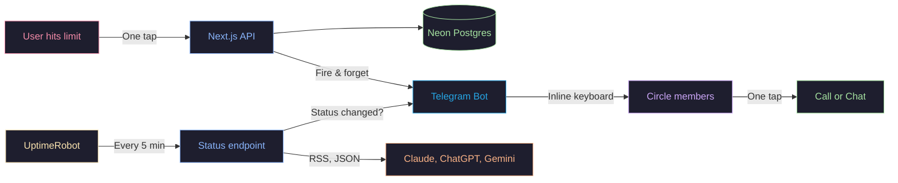

<h1 align="center">DownToTalk</h1>

<p align="center">
  <em>The app that only works when AI doesn't.<br>When Claude, ChatGPT, or Gemini goes down — talk to a human instead.</em>
</p>

<p align="center">
  <a href="https://downtotalk.vercel.app"><strong>Live Demo →</strong></a>
</p>

<p align="center">
  <a href="https://github.com/vasilievyakov/downtotalk/blob/main/LICENSE">
    
  </a>
  
  
  
</p>

<p align="center">
  
  
</p>

---

## Two Moments

<table>
<tr>
<td width="50%" valign="top">

<h3 align="center">The quiet moment</h3>

<p align="center"><em>Personal. Just you.</em></p>

You're deep in a conversation with Claude. Debugging a gnarly issue. Then:

```
Rate limit exceeded.
Please try again later.
```

Nobody else knows. You stare, refresh, wait. Your friend — three time zones away — hit the same wall ten minutes ago.

**You tap "Claude" on the dashboard. One tap.**

Your circle gets a Telegram message with buttons to reach you directly. One more tap — you're talking.

The dead moment becomes a human one.

</td>
<td width="50%" valign="top">

<h3 align="center">The big moment</h3>

<p align="center"><em>Collective. Everyone at once.</em></p>

```
Claude.ai — Major Outage
Elevated error rates across
all services.
```

Thousands of people. Same moment. All stuck. Twitter explodes. Everyone waits alone — together.

**We detect it automatically.** Every 5 minutes, we check official status pages. When a service goes down — your circle gets notified. No button needed.

Your friend's phone buzzes. She taps a button, sees who's available, picks up a call. A 4-hour outage becomes a 4-hour conversation.

> *Average AI outage: **256 minutes.***

</td>
</tr>
</table>

---

## What your friends actually get

<p align="center">
  
</p>

<p align="center">
  <em>Not a link to a dashboard. Not an email you'll read tomorrow.<br>A message with buttons. One tap → you're talking.</em>
</p>

> [!NOTE]
> Buttons are built dynamically from the sender's profile. If they added Telegram, WhatsApp, and Zoom — all three show up. If they added nothing — a note says so, with a dashboard link as fallback.

---

## The dashboard

<p align="center">
  
</p>

<p align="center">
  <em>Live AI status. No login required. Real-time data from official status pages.</em>
</p>

---

## Before and after

<table>
<tr>
<td width="50%">

<h4 align="center">Without DownToTalk</h4>

- You hit a rate limit
- You stare at the screen
- You refresh. You wait
- Claude goes down for everyone
- You check Twitter
- You refresh the status page
- You feel stuck and alone
- The outage ends
- You go back to work

</td>
<td width="50%">

<h4 align="center">With DownToTalk</h4>

- You hit a rate limit
- **You tap one button**
- **Your friends get notified**
- Claude goes down for everyone
- **Your circle already knows**
- **Someone's calling you on Zoom**
- **You have coffee and a conversation**
- The outage ends
- You go back to work, **but lighter**

</td>
</tr>
</table>

---

## The data

| Metric | Value | Source |
|--------|-------|--------|
| Claude uptime (90 days) | 99.64% | status.claude.com |
| Claude.ai uptime (90 days) | 99.38% | status.claude.com |
| Average incident duration | ~256 min | IsDown.app |
| Incidents since Oct 2025 | 144 | IsDown.app |
| Annual downtime | **31 hours** | Calculated |
| Rate limit complaints (daily) | Hundreds | r/ClaudeAI, r/ChatGPT |
| Direct competitors | **Zero** | Market research |

> [!TIP]
> 99.64% uptime sounds great until you realize that's **31 hours of downtime per year.** 31 hours of people staring at error messages — when they could be talking to each other.

---

## What we monitor — and how

| Service | Source | Method |
|---------|--------|--------|
| Claude | `status.claude.com/history.rss` | RSS feed parsing |
| ChatGPT | `status.openai.com/history.rss` | RSS feed parsing |
| Gemini | `status.cloud.google.com/incidents.json` | JSON endpoint |

[UptimeRobot](https://uptimerobot.com) pings `/api/status` every 5 minutes. On each ping:

1. Fetch current status from all three providers
2. Compare with previous status in the database
3. Status degraded → notify subscribers via Telegram
4. Auto-reset availability for users idle > 2 hours

> [!NOTE]
> **Why RSS and not webhooks?** AI providers don't offer outage webhooks. RSS feeds from their status pages are the most reliable public signal. We parse them, compare with last known state, and notify only on transitions — no spam.

---

## Public API

```
GET https://downtotalk.vercel.app/api/status
```

Real-time AI service status + how many people are free. **No API key.** Build dashboards, Slack bots, CLI tools — whatever you want.

<details>
<summary><strong>Example response</strong></summary>

```json
{
  "statuses": [
    {"service": "claude", "status": "operational", "statusText": "Operational"},
    {"service": "openai", "status": "operational", "statusText": "Operational"},
    {"service": "gemini", "status": "operational", "statusText": "Operational"}
  ],
  "availableCount": 2,
  "timestamp": "2026-03-18T20:00:00.000Z"
}
```

</details>

---

## What this is — and isn't

| DownToTalk is | DownToTalk is not |
|---------------|-------------------|
| A way to find your friends when AI is down | A social network |
| Telegram notifications with direct contact buttons | A chat app or video platform |
| Automatic outage detection | A replacement for status pages |
| Free, open source, MIT licensed | A SaaS with plans and pricing |
| Built in a weekend | Built by a team of 50 |

---

## Architecture



<details>
<summary><strong>Stack details</strong></summary>

| Layer | Technology | Why |
|-------|-----------|-----|
| Framework | Next.js 16 (App Router) | SSR for landing, API routes for backend |
| Frontend | React 19, Tailwind CSS 4 | Fast iteration |
| Database | Neon (serverless PostgreSQL) | Scales to zero, generous free tier |
| ORM | Drizzle | Type-safe, lightweight |
| Auth | NextAuth 5 (GitHub OAuth) | Developer audience |
| Notifications | Telegram Bot API | Inline keyboards, no app install needed |
| Monitoring | UptimeRobot (free) | Reliable external cron, 5 min interval |
| Hosting | Vercel (Hobby) | Free, auto-deploy from GitHub |

</details>

<details>
<summary><strong>Key technical decisions</strong></summary>

**Why Telegram, not email or push notifications?**
Telegram has inline keyboard buttons. One tap from the notification → you're in a conversation. Email can't do that. Browser push notifications don't support rich actions. Telegram gives us an app-like experience without building an app.

**Why UptimeRobot, not Vercel Cron?**
Vercel Hobby plan limits cron jobs to once per day. We need checks every 5 minutes. UptimeRobot is free, reliable, and pings our endpoint on schedule.

**Why circles, not a public feed?**
You don't want strangers calling you when Claude goes down. You want your friends. Circles are invite-only groups — you control who sees your availability.

**Why 2-hour TTL on availability?**
Without it, people who toggle "available" and forget about it stay visible forever. Ghost users destroy trust. After 2 hours, you're automatically set to unavailable.

</details>

---

## Get started

**As a user:** Visit **[downtotalk.vercel.app](https://downtotalk.vercel.app)** → sign in with GitHub → choose your AI services → connect Telegram. Done.

**As a developer:**

```bash
git clone https://github.com/vasilievyakov/downtotalk.git
cd downtotalk && npm install && cp .env.example .env.local && npm run dev
```

<details>
<summary><strong>Environment variables</strong></summary>

| Variable | Description |
|----------|-------------|
| `DATABASE_URL` | Neon pooled connection string |
| `DATABASE_URL_UNPOOLED` | Neon direct connection (for migrations) |
| `AUTH_SECRET` | NextAuth secret |
| `AUTH_GITHUB_ID` | GitHub OAuth app ID |
| `AUTH_GITHUB_SECRET` | GitHub OAuth app secret |
| `TELEGRAM_BOT_TOKEN` | Telegram bot token |
| `TELEGRAM_WEBHOOK_SECRET` | Webhook verification secret |

</details>

---

## Why I built this

Claude went down during a deadline. I sat there refreshing the status page for twenty minutes. Then I realized — my friend was probably doing the same thing right now, three time zones away. We could have just talked.

Rate limits hit thousands of people daily. Every one of those moments is a person sitting alone in front of a screen, waiting for a machine to come back. What if that moment connected them instead?

---

<p align="center">
  <em>We spend 8 hours a day talking to machines.<br>
  When the machines stop talking back, we stare at error messages.</em>
</p>

<p align="center">
  <strong><a href="https://downtotalk.vercel.app">downtotalk.vercel.app</a></strong>
</p>

<p align="center">
  <em>Built in a weekend with <a href="https://claude.ai/code">Claude Code</a>. Because sometimes the best thing AI can do is shut up.</em>
</p>
